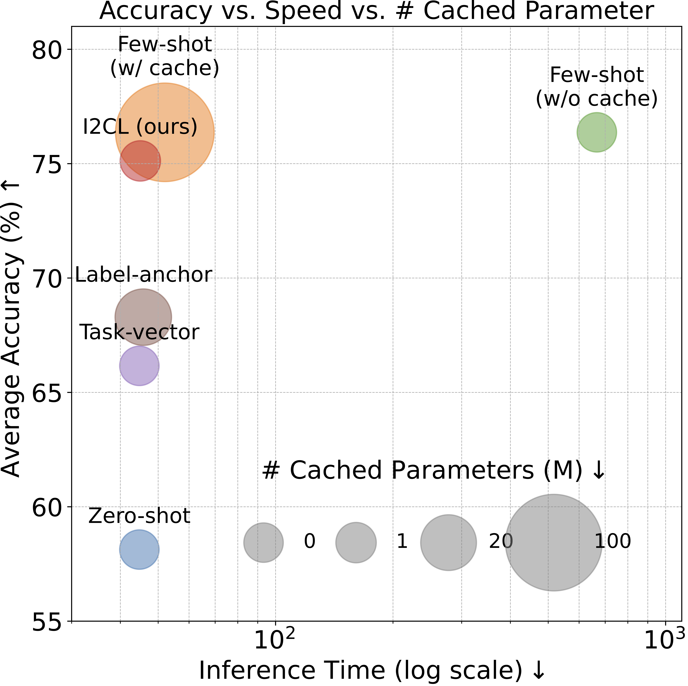

# I2CL: Implicit In-context Learning for Large Language Models

<table>
  <tr>
    <td></td>
    <td></td>
  </tr>
</table>

## What's New?
### 🌟 Introducing I2CL: a new paradigm to leverage demonstration examples:
Implicit In-context Learning (I2CL) absorbs a tiny set of demonstration examples in the activation space, diverging from standard In-context Learning (ICL) that prefixes demonstration examples in the token space. As a result, I2CL bypasses the limitation of the context window size.

### 🌟 Efficiency
I2CL is extremely efficient in terms of both computation and memory usage. It achieves few-shot (i.e., ICL) performance with approximately zero-shot cost at inference.

### 🌟 Robustness
I2CL is robust against the selection and order of demonstration examples. It yields satisfying performance even under deficient demonstration examples which can severely degrade the performance of ICL.

### 🌟 Generation of "Task-ID"
I2CL introduces a set of scalar values that act as task-IDs. These task-IDs effectively indicate the task similarity and can be leveraged to perform transfer learning across tasks.

### 🌟 Better Understanding of ICL
I2CL substantiates a two-stage workflow. A context vector is first generated by condensing the demonstration examples independently. Then a linear combination of the context vector and activation from the query is injected back into the residual streams. The effectiveness of I2CL suggests a potential two-stage workflow for ICL.

## Installation
1. **Clone the Repository**:

    ```bash
    git clone https://github.com/LzVv123456/I2CL
    cd yourrepository
    ```

2. **Create a Conda Environment**:

    Create a new conda environment to avoid conflicts with existing packages.

    ```bash
    conda create --name i2cl_env python=3.8
    conda activate i2cl_env
    ```

3. **Install Dependencies**:

    Use `pip` to install the required libraries listed in the `requirements.txt` file.

    ```bash
    pip install -r requirements.txt
    ```


## Usage

To use the code, follow these steps:

1. **Navigate to the I2CL Folder**:

    ```bash
    cd I2CL
    ```

2. **Run I2CL**:

    To run I2CL, execute the following command:

    ```bash
    python run_i2cl.py
    ```

3. **Run Comparable Methods**:

    To run other comparable methods, use the following commands:

    ```bash
    python run_soft_prompt.py
    python run_task_vector.py
    python run_label_anchor.py
    ```

4. **Apply I2CL to Unseen Demonstrations or Perform Transfer Learning**:

    First, run `run_i2cl.py` and specify the target path in the configuration files for `run_i2cl_infer.py` and `run_i2cl_transfer_learning.py` as the output result folder of `run_i2cl.py`.

    Then, execute the following commands:

    ```bash
    python run_i2cl_infer.py
    python run_i2cl_transfer_learning.py
    ```

5. **Configuration and Ablation Studies**

    For ablation studies and other configurations, please refer to `configs/config_i2cl.py` and the corresponding code files for more details.

## License

This project is licensed under the MIT License - see the [LICENSE](LICENSE) file for details.

## Acknowledgments

I would also like to acknowledge the repositories that inspired and contributed to this work:
- [icl_task_vectors](https://github.com/roeehendel/icl_task_vectors)
- [label-words-are-anchors](https://github.com/lancopku/label-words-are-anchors)


## Citation
If you found this work useful for your research, feel free to star ⭐ the repo or cite the following paper:
```
@misc{li2024implicit,
      title={Implicit In-context Learning}, 
      author={Zhuowei Li and Zihao Xu and Ligong Han and Yunhe Gao and Song Wen and Di Liu and Hao Wang and Dimitris N. Metaxas},
      year={2024},
      eprint={2405.14660},
      archivePrefix={arXiv},
      primaryClass={cs.LG}
}
```
